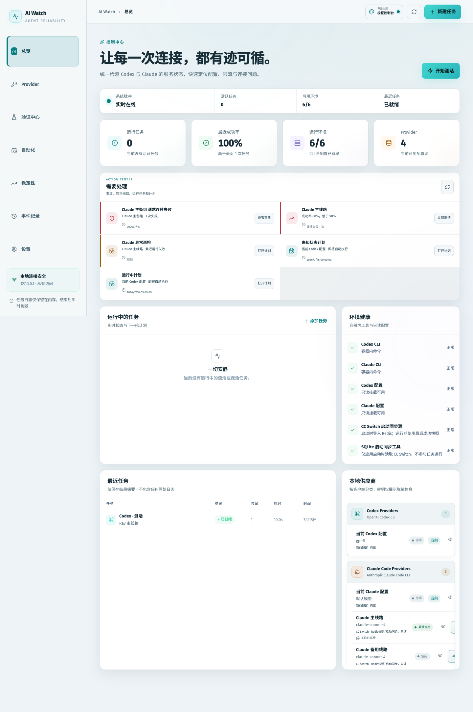
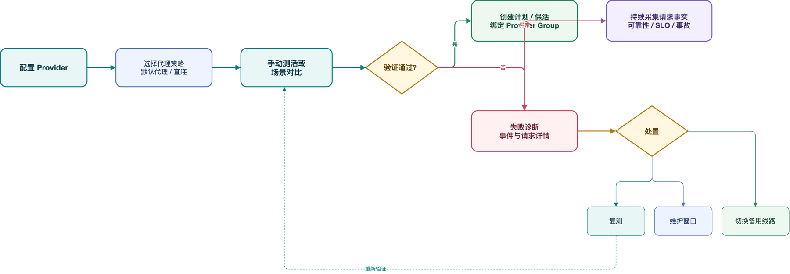
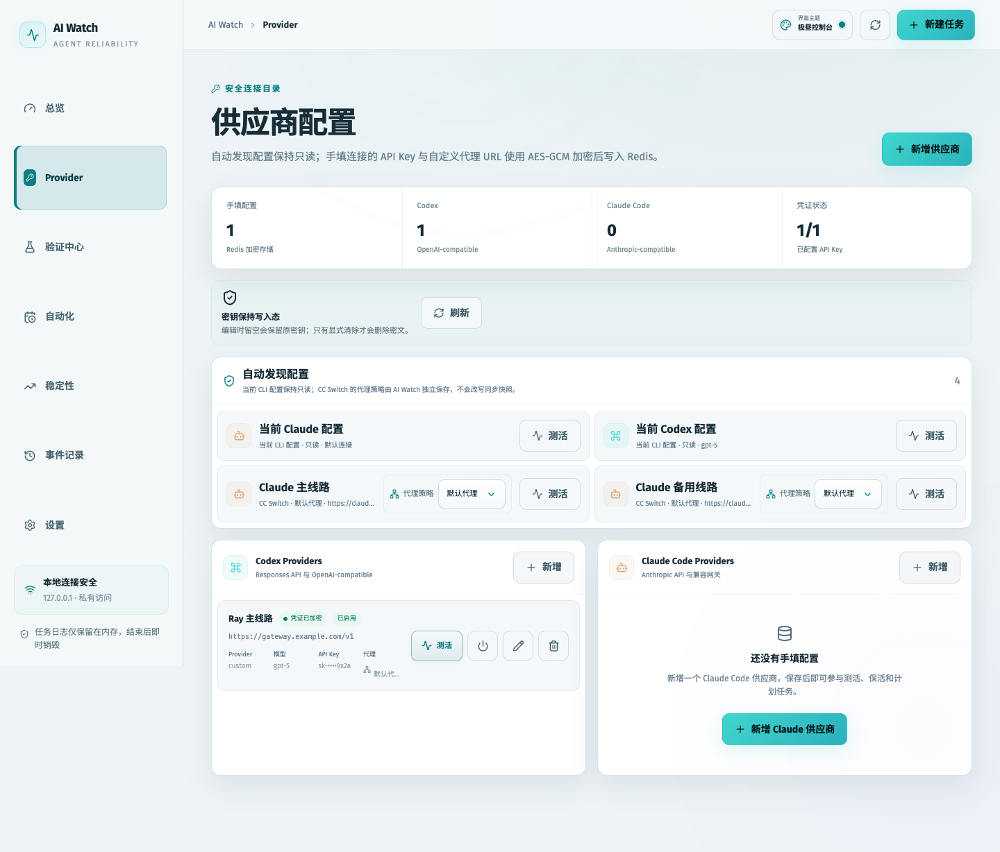
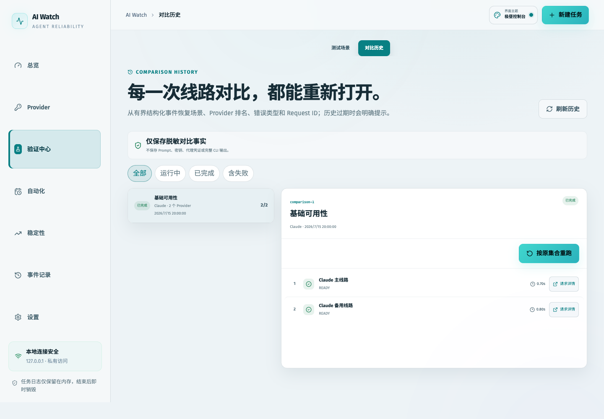
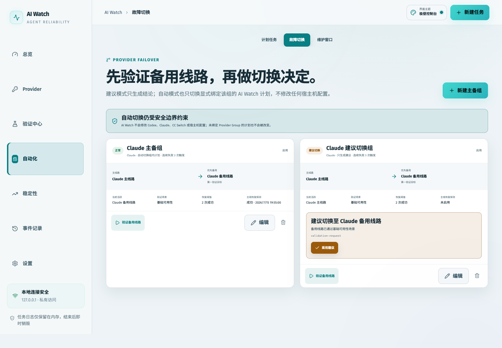
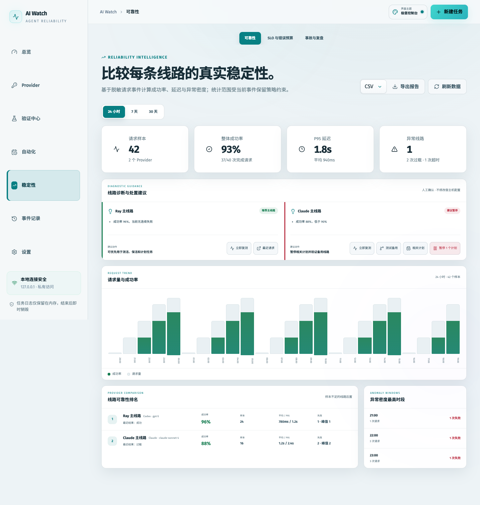
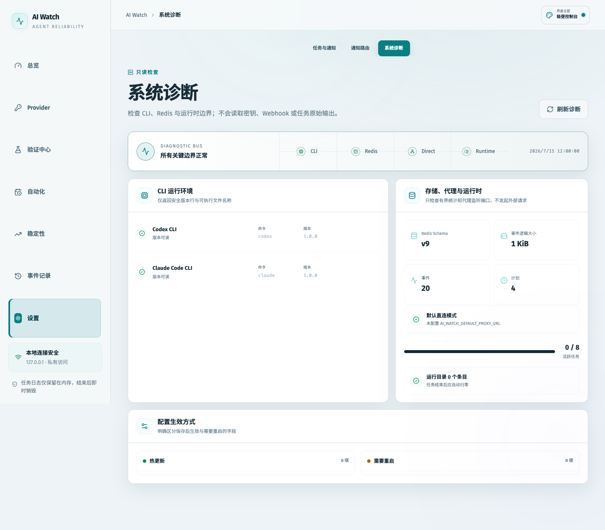
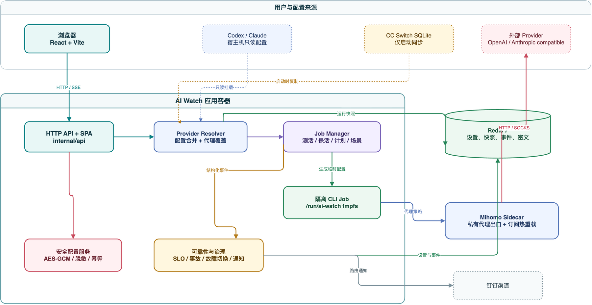

# AI Watch

[中文文档](README_ZH.md)

AI Watch is a local operations and reliability console for Codex and Claude providers. It runs the official CLIs in isolated job directories, records structured request facts, and brings provider validation, scheduling, reliability analysis, incident handling, failover, and notifications into one web interface.

The default workflow is:

> Configure providers → validate a provider or scenario → create schedules → inspect failures → respond or switch routes

The web console is bound to the local machine by default:

```text
http://127.0.0.1:8787
```

[](docs/images/dashboard.png)

The screenshots are generated from the current frontend with Playwright and built-in redacted demo data; real provider credentials are not required.

## Operating Workflow

[](docs/diagrams/system-workflow.png)

AI Watch validates a route before schedules continuously collect request facts. Failures flow into events, request details, and incident timelines, where an operator can retest, apply a maintenance window, or switch to a backup route. Provider-group auto-switching affects explicitly bound AI Watch schedules only.

[Editable workflow source](docs/diagrams/system-workflow.drawio)

## Highlights

- **Provider management** — combines the current Codex/Claude CLI configuration, startup snapshots imported from CC Switch, and manually maintained providers whose credentials are encrypted with AES-GCM.
- **Manual and synthetic validation** — runs one-off probes, keepalive jobs, and reusable test scenarios across one or more providers for side-by-side comparison.
- **Automation** — schedules validation by timezone, weekday, and time window, while keeping request history associated with the exact `scheduleId`.
- **Reliability and SLOs** — compares success rate, latency, failure density, anomaly signals, and error budgets across configurable time ranges.
- **Incidents** — groups repeated failures into an auditable timeline with acknowledgement, mute, notes, recovery, and redacted request references.
- **Provider groups and failover** — validates prioritized backup routes and supports advisory or automatic switching for schedules explicitly bound to a group.
- **Maintenance windows** — centrally suppress notifications, backup validation, and automatic switching without stopping already-running jobs.
- **Events and request facts** — separates operational events from redacted CLI request records. Request details remain directly accessible at `/requests/:requestId` and support browser back navigation.
- **Notification routing** — routes supported message types to DingTalk channels and provides digest preview and delivery controls.
- **Read-only diagnostics** — reports CLI, Redis, configuration, runtime, and CC Switch synchronization health without exposing a general Redis key-management interface.

## Product Areas

The primary navigation is defined centrally in `frontend/src/navigation.ts`:

| Area | Main routes | Purpose |
| --- | --- | --- |
| Overview | `/` | Current provider, task, and environment status |
| Providers | `/providers` | Provider discovery, manual configuration, enablement, and probes |
| Validation | `/validation/*` | Test scenarios and comparison history |
| Automation | `/automation/*` | Schedules, failover groups, and maintenance windows |
| Stability | `/stability/*` | Reliability, SLOs, and incidents |
| Events | `/events` | Operational events and request records |
| Settings | `/settings/*` | Runtime settings, notifications, routing, and diagnostics |

Legacy page paths are normalized to the corresponding product area. Request detail deep links use `/requests/:requestId`.

## Product Tour

<table>
  <tr>
    <td width="50%"><strong>Providers</strong><br/>Discover read-only CLI configuration, maintain encrypted manual providers, and choose a proxy policy per route.<br/><a href="docs/images/providers.png"></a></td>
    <td width="50%"><strong>Validation</strong><br/>Save reusable scenarios, compare providers, and reopen historical request facts.<br/><a href="docs/images/validation.png"></a></td>
  </tr>
  <tr>
    <td width="50%"><strong>Automation</strong><br/>Manage schedules, provider groups, advisory or automatic failover, and maintenance windows.<br/><a href="docs/images/automation.png"></a></td>
    <td width="50%"><strong>Stability</strong><br/>Inspect success rate, latency, anomaly windows, SLOs, error budgets, and incident guidance.<br/><a href="docs/images/stability.png"></a></td>
  </tr>
  <tr>
    <td width="50%"><strong>Settings and notifications</strong><br/>Configure jobs, notification routing, and Mihomo subscriptions without returning saved secrets in plaintext.<br/><a href="docs/images/settings.png"></a></td>
    <td width="50%"><strong>Overview</strong><br/>Combine providers, actionable failures, running jobs, schedules, and environment health in one view.<br/><a href="docs/images/dashboard.png"></a></td>
  </tr>
</table>

## Quick Start

### Requirements

- Docker Desktop on macOS, or Docker Engine with Compose v2 on Linux
- Existing host directories for Codex, Claude, and CC Switch configuration

Create the mount sources and start the stack:

```bash
mkdir -p ~/.codex ~/.claude ~/.cc-switch
docker compose up -d --build
```

The Compose stack starts:

- `ai-watch` — the Go API, React web app, Codex CLI, and Claude CLI
- `redis` — required internal storage for settings, provider snapshots, encrypted credentials, events, and runtime metadata
- `mihomo` — a private proxy sidecar used by provider-level proxy policies

Open `http://127.0.0.1:8787` after the services become healthy.

Check status and logs:

```bash
docker compose ps
docker compose logs -f ai-watch
curl http://127.0.0.1:8787/api/health
```

Stop the stack while retaining data:

```bash
docker compose down
```

Remove the stack and all named volumes:

```bash
docker compose down -v
```

## Configuration Sources

Compose mounts the following host directories as read-only:

| Host path | Container path | Usage |
| --- | --- | --- |
| `~/.codex` | `/home/aiwatch/.codex` | Current Codex configuration and authentication |
| `~/.claude` | `/home/aiwatch/.claude` | Current Claude configuration and authentication |
| `~/.cc-switch` | `/home/aiwatch/.cc-switch` | Startup-only CC Switch SQLite source |

AI Watch does not modify these directories.

CC Switch is a startup synchronization source, not the runtime database. On application startup, providers are read from the mounted SQLite database and copied to Redis. If synchronization fails, the last successful Redis snapshot is retained. Restart `ai-watch` after changing CC Switch:

```bash
docker compose restart ai-watch
docker compose logs --tail=100 ai-watch
```

Manually created providers are stored in Redis. API keys are encrypted with AES-GCM before persistence and are not returned to the browser after they are saved.

## Environment Configuration

Copy the example file before overriding defaults:

```bash
cp .env.example .env
```

Common options:

| Variable | Default | Description |
| --- | --- | --- |
| `AI_WATCH_PORT` | `8787` | Local web port, bound to `127.0.0.1` |
| `REDIS_PORT` | `6379` | Local Redis port, bound to `127.0.0.1` |
| `AI_WATCH_REDIS_URL` | `redis://redis:6379/0` | Required Redis connection used inside Compose |
| `AI_WATCH_MASTER_KEY` | empty | Optional 32-byte credential-encryption key; a persisted local key is used when omitted |
| `CODEX_CONFIG_DIR` | `${HOME}/.codex` | Host Codex configuration directory |
| `CLAUDE_CONFIG_DIR` | `${HOME}/.claude` | Host Claude configuration directory |
| `CC_SWITCH_CONFIG_DIR` | `${HOME}/.cc-switch` | Host CC Switch directory used during startup sync |
| `AI_WATCH_CC_SWITCH_SYNC_TIMEOUT_SECONDS` | `10` | Timeout for copying and querying the CC Switch database |
| `AI_WATCH_RUNTIME_TMPFS_SIZE` | `256m` | In-memory runtime workspace for concurrent jobs and temporary CC Switch snapshots |
| `MIHOMO_CONFIG_FILE` | `./config/mihomo/config.yaml.example` | Read-only Mihomo configuration file |
| `AI_WATCH_DEFAULT_PROXY_URL` | `http://mihomo:7890` | Default provider proxy inside Compose |
| `AI_WATCH_MIHOMO_CONTROLLER_URL` | `http://mihomo:9090` | Private controller used for subscription hot reload |
| `AI_WATCH_MIHOMO_TEST_URL` | `https://www.gstatic.com/generate_204` | Fixed outbound target for proxy validation |
| `DINGTALK_WEBHOOK_URL` | empty | Optional DingTalk webhook imported into application configuration |
| `CODEX_CLI_VERSION` | `latest` | Codex npm package version installed during image build |
| `CLAUDE_CLI_VERSION` | `latest` | Claude Code npm package version installed during image build |

`.env.example` also documents Redis limits, image overrides, proxy variables, OpenAI/Codex credentials, Anthropic/Claude credentials, and Bedrock or Vertex-related environment variables.

Do not commit API keys, DingTalk webhooks, subscription URLs, proxy credentials, or cloud credentials.

### Custom mount paths

Use absolute paths when the configuration directories are not under the current user's home directory:

```dotenv
CODEX_CONFIG_DIR=/Users/your-name/.codex
CLAUDE_CONFIG_DIR=/Users/your-name/.claude
CC_SWITCH_CONFIG_DIR=/Users/your-name/.cc-switch
```

On macOS, make sure Docker Desktop is allowed to share custom paths. On Linux, run Compose as the user that owns the configuration files or set explicit absolute paths. Keep host credential files private; do not weaken their permissions to work around Docker or SELinux configuration issues.

## Proxy Sidecar

The default Mihomo configuration in `config/mihomo/config.yaml.example` is a safe direct-routing baseline. Mihomo ports are not published to the host; AI Watch reaches the sidecar through the internal Compose network.

The System Settings page can store a subscription URL with the same AES-GCM key used for other secure configuration. Saving generates a constrained runtime configuration in the private Mihomo volume, reloads the private controller, waits for subscription nodes, and validates outbound connectivity. Failed updates roll back to the previous working configuration. Clearing the page-managed subscription reloads `MIHOMO_CONFIG_FILE`, which is DIRECT by default.

To use a private Mihomo configuration, keep it outside the repository and set:

```dotenv
MIHOMO_CONFIG_FILE=/absolute/path/to/mihomo.yaml
```

Then restart and verify the sidecar:

```bash
docker compose restart mihomo
docker compose ps mihomo
docker compose logs --tail=100 mihomo
```

Providers can select the default proxy, direct access, or a custom proxy. Subscription URLs saved through the page are never returned in plaintext. Never commit subscription URLs or proxy credentials.

## Security and Data Boundaries

- The web port and Redis port are published on `127.0.0.1` only.
- Codex and Claude jobs run with dedicated temporary configuration under `/run/ai-watch`.
- Host CLI and CC Switch directories are mounted read-only.
- CLI prompts and provider responses are stored as redacted, length-limited facts where applicable.
- Redis is mandatory internal application storage; it is exposed only through health and diagnostic information, not a general key browser or `/api/redis/*` API.
- Provider-group switching changes AI Watch state and explicitly bound schedules only. It does not rewrite host Codex, Claude, or CC Switch configuration.
- Maintenance windows suppress automated actions and notifications but do not terminate running jobs.
- All frontend write requests automatically include an `Idempotency-Key`.

## System Architecture

[](docs/diagrams/system-architecture.png)

- The browser uses the React/Vite SPA through HTTP APIs and SSE.
- The AI Watch container merges read-only host configuration, the startup CC Switch snapshot, and manual providers from Redis, then creates isolated temporary configuration for each job.
- Redis stores settings, provider snapshots, encrypted configuration, events, and runtime metadata. Mihomo supplies a Compose-private proxy exit and subscription hot reload.
- Reliability, SLO, incident, failover, and notification features consume structured redacted request facts rather than a general Redis key browser or raw CLI output.

[Editable architecture source](docs/diagrams/system-architecture.drawio)

## Local Development

### Prerequisites

- Go 1.24
- Node.js 22 and npm
- Redis 7-compatible server
- Codex and/or Claude CLI for real provider jobs

Install frontend dependencies and start Redis:

```bash
cd frontend && npm install
cd ..
docker compose up -d redis
```

Run the backend from the repository root:

```bash
AI_WATCH_REDIS_URL=redis://127.0.0.1:6379/0 \
AI_WATCH_DATA_DIR=./data \
go run ./cmd/ai-watch
```

In another terminal, start Vite:

```bash
cd frontend
npm run dev
```

The development frontend listens on `http://127.0.0.1:5173` and proxies `/api` to `http://127.0.0.1:8787`.

Useful build commands:

```bash
make backend
make frontend
make build
make test
```

## Validation

Run the project validation commands before submitting changes:

```bash
go test ./...
cd frontend && npm run build && npm run test:e2e
docker compose config --quiet
```

Install Playwright Chromium once if needed:

```bash
cd frontend
npm run test:e2e:install
```

The frontend end-to-end suite starts its own Vite server on port `4173` and uses mocked API behavior, so it does not require real provider credentials.

Regenerate the README screenshots with:

```bash
cd frontend
npm run docs:screenshots
```

The screenshot task uses a 1440×960 viewport, the Arctic Daylight theme, and redacted demo data. Editable draw.io sources live in `docs/diagrams` and can be exported again to the matching PNG filenames with the draw.io desktop app.

## Deployment

Build and replace only the application service:

```bash
docker compose build ai-watch
docker compose up -d ai-watch
```

Pin `CODEX_CLI_VERSION`, `CLAUDE_CLI_VERSION`, and production image tags or digests for reproducible deployments.

## Troubleshooting

### Bind source path does not exist

Create the default mount sources or set absolute paths in `.env`:

```bash
mkdir -p ~/.codex ~/.claude ~/.cc-switch
```

### A CLI is unavailable

Check the installed versions:

```bash
docker compose exec ai-watch codex --version
docker compose exec ai-watch claude --version
```

Pin a known-good CLI version in `.env` and rebuild if an upstream release is incompatible.

### Configuration cannot be read

Inspect the resolved mounts and container paths:

```bash
docker compose config
docker compose exec ai-watch sh -c 'ls -la ~/.codex ~/.claude ~/.cc-switch'
```

Check Docker Desktop file sharing or SELinux labeling instead of making credential files globally readable.

### CC Switch changes are not visible

CC Switch is synchronized only at startup:

```bash
docker compose restart ai-watch
```

If the new synchronization fails, AI Watch continues using the last successful Redis snapshot. Check the Diagnostics page and application logs for details.

### Runtime reports `no space left on device`

`/run/ai-watch` is an in-memory filesystem used for temporary job credentials, CLI configuration, and CC Switch snapshots. Increase `AI_WATCH_RUNTIME_TMPFS_SIZE` in `.env`, then recreate the application container:

```bash
AI_WATCH_RUNTIME_TMPFS_SIZE=512m
docker compose up -d --force-recreate ai-watch
```

### Health checks fail

```bash
docker compose logs ai-watch
docker compose ps
```

Confirm that ports `8787` and `6379` are available, or override `AI_WATCH_PORT` and `REDIS_PORT` in `.env`.

## License

No license file is currently included in this repository.
